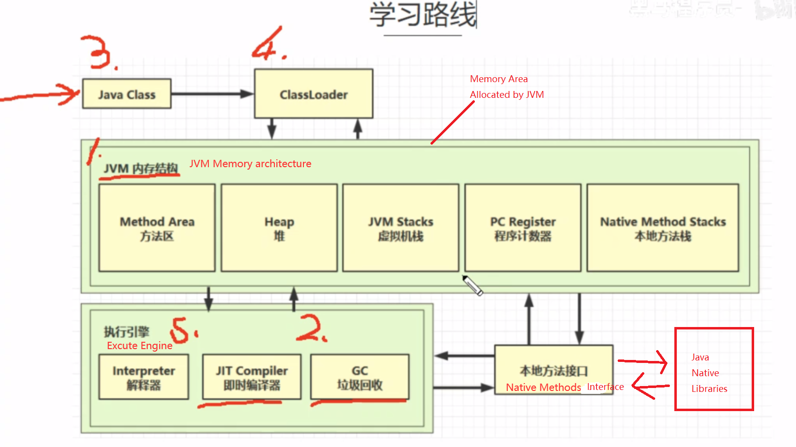
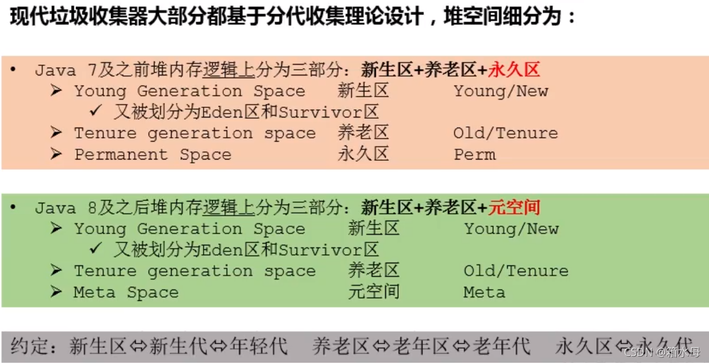
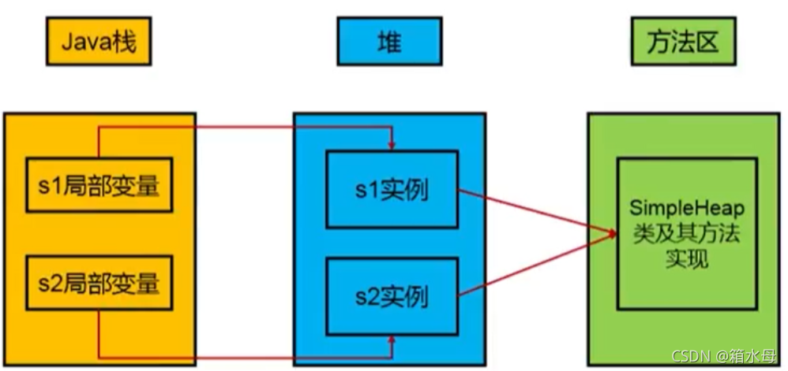
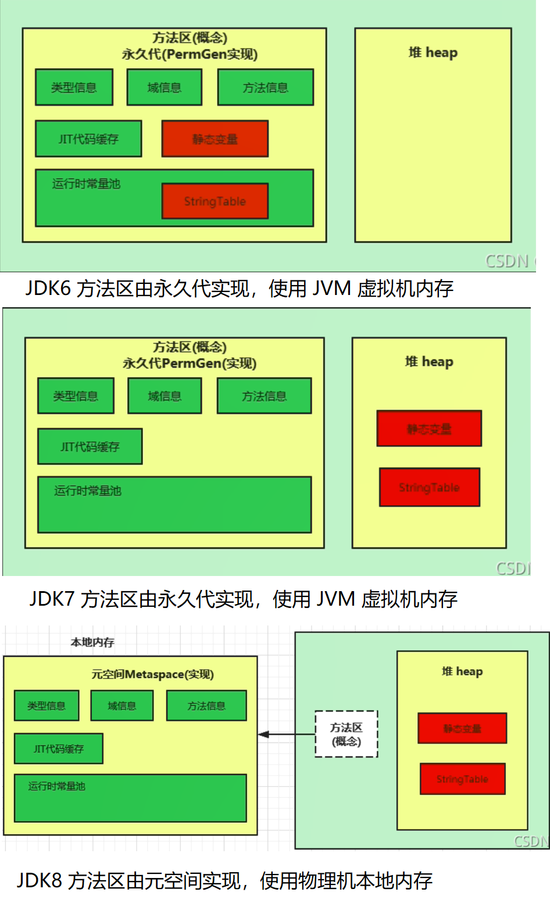

# JVM_Memory_Architecture

total:

<!--more-->

## PC Register

* 是物理上寄存器计数器的抽象、当前线程所执行的字节码的行号指示器。字节码解释器工作时，通过改变这个计数器的值来确定下一条要执行的字节码指令的位置。
* 一块很小的内存空间，几乎可以忽略不记，也是运行速度最快的存储区域
* 执行 Java 方法和 native 方法时的区别：
  - 执行 Java 方法时：前线程正在执行的Java方法的JVM指令地址。
  - 执行 native 方法时：无定义。
* 在JVM规范中，每个线程都有它自己的程序计数器，是线程私有的，生命周期与线程的生命周期保持一致。
* Java虚拟机规范中，唯一不会出现 OOM 的区域。

#### PC寄存器（程序计数器）为什么被设定为私有的？

> 由于Java虚拟机的多线程是通过线程之间的轮换、分配处理器执行时间的方式来实现的，在任何一个时刻，一个处理器(对于多核的处理器来说是一个核)都只会执行一条线程中的指令。因此，为了线程切换过后能够恢复到原来正确的执行位置，每条线程都需要一个独立的程序计数器，每条线程之间各不影响，独立存储。

#### CPU 时间片

> CPU时间片即CPU分配给各个程序的时间，每个线程被分配一个时间段，称作它的时间片。
> 在宏观上：我们可以同时打开多个应用程序，每个程序并行不悖，同时运行。
> 但在微观上：由于只有一个CPU，一次只能处理程序要求的一部分，如何处理公平，一种方法就是引入时间片，每个程序轮流执行。

#### pc寄存器的值

这里的“pc寄存器”是在抽象的JVM层面上的概念——当执行Java方法时，这个抽象的“pc寄存器”存的是Java字节码的地址。实现上可能有两种形式，一种是相对该方法字节码开始处的偏移量，叫做bytecode index，简称bci；另一种是该Java字节码指令在内存里的地址，叫做bytecode pointer，简称bcp。

对native方法而言，它的方法体并不是由Java字节码构成的，自然无法应用上述的“Java字节码地址”的概念。所以JVM规范规定，如果当前执行的方法是native的，那么pc寄存器的值未定义——是什么值都可以。

#### Java多线程执行native方法时程序计数器为空，那么线程切换后如何找到之前执行到哪里了？

**不知道。 **Java多线程执行native方法时程序计数器为空，那么线程切换后如何找到之前执行到哪里了？ - 知乎 https://www.zhihu.com/question/40598119

## Java 虚拟机栈

- Java 方法执行的内存模型，每个线程运行时所需要的内存。每个方法执行的过程，就是它所对应的栈帧在虚拟机栈中入栈到出栈的过程。
- 服务于 Java 方法。
- 由栈帧组成，每个栈帧对应一次方法调用。有一个活动栈帧，表示正在执行的那个方法。
- 可能抛出的异常：
  - OutOfMemoryError（在虚拟机栈可以动态扩展的情况下，扩展时无法申请到足够的内存）；
  - StackOverflowError（线程请求的栈深度 > 虚拟机所允许的深度）；
- 虚拟机参数设置：`-Xss`.

#### 垃圾回收是否涉及栈内存

不涉及。栈内存在每个方法执行完毕，自动弹出对应的栈帧了。

#### 为了防止OOM，栈内存设置越大越好吗？

不是的。因为会影响线程数量。

#### 方法里的局部变量是否线程安全？

根据局部变量是否逃离方法的作用范围而定。比如参数、返回值不是线程安全的。

#### 线程运行诊断方法

top pid

ps H -eo pid,tid,%cup |grep pid 找到tid

jstack pid 然后根据tid定位代码位置

## 本地方法栈

- 服务于 native 方法。
- 可能抛出的异常：同 Java 虚拟机栈。

## Java 堆

- 唯一的目的：存放对象实例。
- 垃圾收集器管理的主要区域。
- 线程共享的。所有的线程共享Java堆，并发性就差，在这里还可以划分线程私有的缓冲区（Thread Local Allocation Buffer，TLAB），提高并发性。
- 可以处于物理上不连续的内存空间中，但在逻辑上它应该被视为连续的。
- 数组和对象可能永远不会存储在栈上，因为栈帧中保存引用，这个引用指向对象或者数组在堆中的位置。
- 可能抛出的异常：
  - OutOfMemoryError（堆中没有内存可以分配给新创建的实例，并且堆也无法再继续扩展了）。
- 虚拟机参数设置：
  - -Xms用于表示堆区的起始内存，等价于
    -XX:InitialHeapSize
  - -Xmx则用于表示堆区的最大内存，等价于
    -XX:MaxHeapSize
  - 两个参数设置成相同的值可避免堆自动扩展(能够在Java垃圾回收机制清理完堆区后不需要重新分隔计算堆区的大小，从而提高性能)。
  - 默认情况下:
    初始内存大小：物理电脑内存大小/64
    最大内存大小：物理电脑内存大小/4
- 堆细节划分

#### 所有的对象实例分配在堆上吗？

否。“几乎”所有的对象实例都在这里分配内存。因为还有一些对象是在栈上分配的。

#### 对象实体所属的类是什么，定义的结构方法都在哪里？

在方法区中。

#### 堆内存诊断方法

jps 查看有哪些java进程

jmap -heap pid 查看堆内存占用情况

jconsole 图形化连续监测内存变化等

jpofiler

jvitualvm

## 方法区

- 存储已被虚拟机加载的类信息、常量、静态变量、即时编译器编译后的代码等数据；	
  - 类信息：即 Class 类，如类名、访问修饰符、常量池、字段描述、方法描述等。
- 垃圾收集行为在此区域很少发生；
  - 不过也不能不清理，对于经常动态生成大量 Class 的应用，如 Spring 等，需要特别注意类的回收状况。
- 可能抛出的异常：
  - java.lang.OutofMemoryError:PermGen space（JDK7及之前）
  - java.lang.OutOfMemoryError:Metaspace（JDK8及之后）
- 设置大小
  * -XXMaxPermSize=xx（JDK7及之前）
  * -XX:MetaspaceSize=xx（JDK8及之后）

### 常量池

* 一个有效的字节码文件中除了包含类的版本信息、字段、方法以及接口等描述符信息外。还包含一项信息就是常量池表（Constant Pool Table），包括各种字面量（10、“hello”）和对类型、域和方法的符号引用

* 常量池可以看做是一张表，虚拟机指令根据这张常量表找到要执行的类名、方法名、参数类型、字面量等类型

#### 为什么需要常量池？

一个java源文件中的类、接口，编译后产生一个字节码文件。而Java中的字节码需要数据支持，通常这种数据会很大以至于不能直接存到字节码里，换另一种方式，可以存到常量池。

字节码包含了指向常量池的引用。在动态链接的时候会用到运行时常量池。

### 运行时常量池

* 运行时常量池是方法区的一部分。

- Class 文件中除了有类的版本、字段、方法、接口等描述信息外，还有一项是常量池。常量池表（Constant Pool Table）是Class字节码文件的一部分，用于存放编译期生成的各种字面量与符号引用，这部分内容将在类加载后存放到方法区的运行时常量池中。
- 运行时常量池中包含多种不同的常量，此时不再是常量池中的符号地址了，这里换为真实地址。

#### 举例方法区OOM

* 加载大量的第三方的jar包
* Tomcat部署的工程过多（30~50个）
* 大量动态的生成反射类。如spring、mybatis 通过 cglib 动态生成大量字节码类。

#### 方法区什么时间分配、释放内存？

在JVM启动的时候被创建。关闭JVM就会释放这个区域的内存。

#### 永久代为什么要被元空间替代？

由于类的元数据分配在本地内存中，元空间的最大可分配空间就是系统可用内存空间，这项改动是很有必要的，原因有：

1、为永久代设置空间大小是很难确定的。

* 在某些场景下，如果动态加载类过多，容易产生Perm区的OOM。比如某个实际Web工
  程中，因为功能点比较多，在运行过程中，要不断动态加载很多类，经常出现致命错误。Exception in thread ‘dubbo client x.x connector’ java.lang.OutOfMemoryError:PermGen space

* 而元空间和永久代之间最大的区别在于：元空间并不在虚拟机中，而是使用本地内存。
  因此，默认情况下，元空间的大小仅受本地内存限制。

2、对永久代进行调优是很困难的。

* 方法区的垃圾收集主要回收两部分内容：常量池中废弃的常量和不再使用的类型。

#### Hotspot 方法区变化过程

#### 常量池中的StringTable特性

* 常量池中的字符串仅仅是符号，第一次用到时，才变为对象。
* 利用串池的机制，避免重复创建字符串对象。
* 字符串变量拼接原理：运行时StringBuilder对象append处理+号拼接。
* 字符串变量拼接原理：编译器能确定下来的，编译器会优化。
* intern()方法主动将串池中还没有的字符串对象放入串池。

## 直接内存

- 常见于NIO操作，用于数据缓冲区。
- 分配、回收成本较高，但是读写性能高。
- 不受JVM内存回收管理。
- JDK 1.4 的 NIO 类可以使用 native 函数库直接分配堆外内存，这是一种基于通道与缓冲区的 I/O 方式，它在 Java 堆中存储一个 DirectByteBuffer 对象作为堆外内存的引用，这样就可以对堆外内存进行操作了。因为可以避免 Java 堆和 Native 堆之间来回复制数据，在一些场景可以带来显著的性能提高。
- 虚拟机参数设置：`-XX:MaxDirectMemorySize`
  - 默认等于 Java 堆最大值，即 `-Xmx` 指定的值。
- 将直接内存放在这里讲解的原因是它也可能会出现 OutOfMemoryError；
  - 服务器管理员在配置 JVM 参数时，会根据机器的实际内存设置 `-Xmx` 等信息，但经常会忽略直接内存（默认等于 `-Xmx` 设置值），这可能会使得各个内存区域的总和大于物理内存限制，从而导致动态扩展时出现 OOM。
- 直接内存的释放：通过Unsafe对象完成直接内存的分配、回收，并且回收主要主动调用freeMemory方法（反射拿到，手动分配与释放）
- ByteBuffer的实现类内部，使用了Cleaner(虚引用)来检测ByteBuffer对象。一旦ByteBuffer对象被垃圾回收，那么就会由ReferenceHandler线程通过Cleaner的clean方法调用freeMemory来释放直接内存。

1、https://www.bilibili.com/video/BV1yE411Z7AP

2、https://www.zhihu.com/question/40598119/answer/87381512

3、https://github.com/TangBean/understanding-the-jvm

4、https://blog.csdn.net/poppy_poppy/category_11333981.html