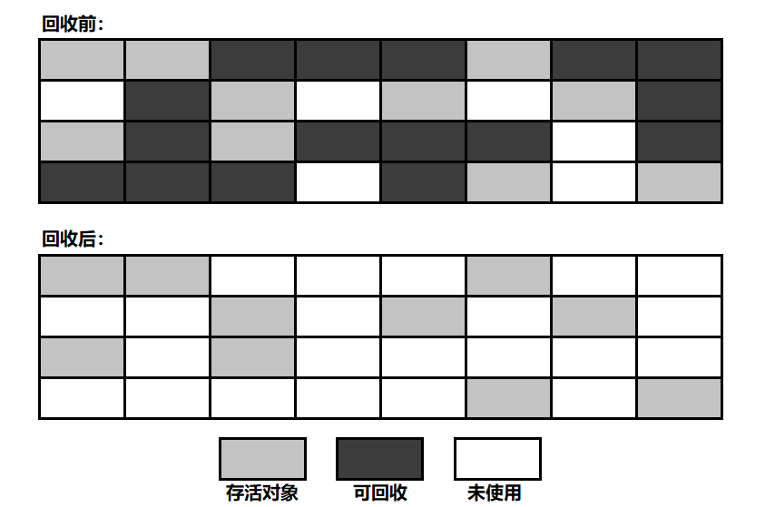
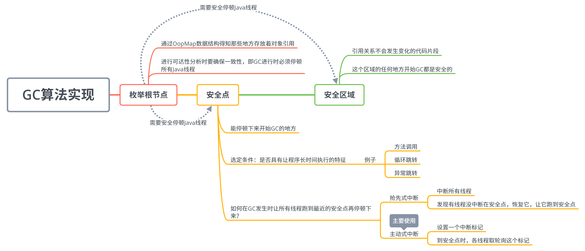
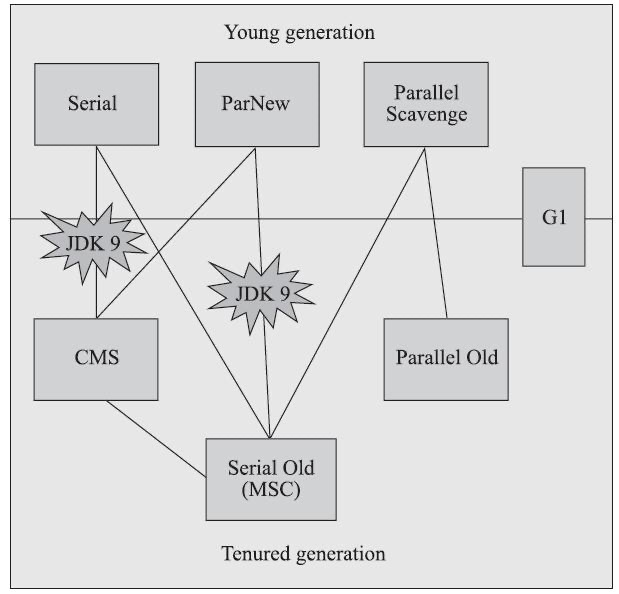
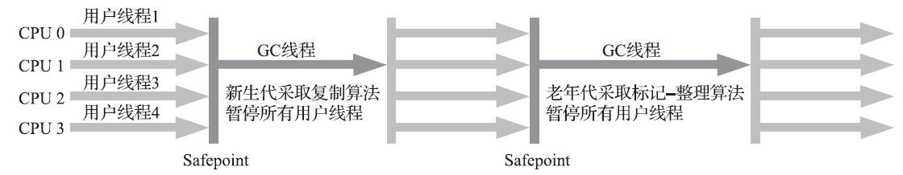
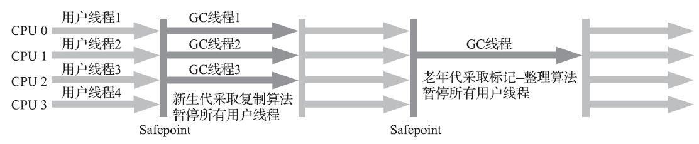
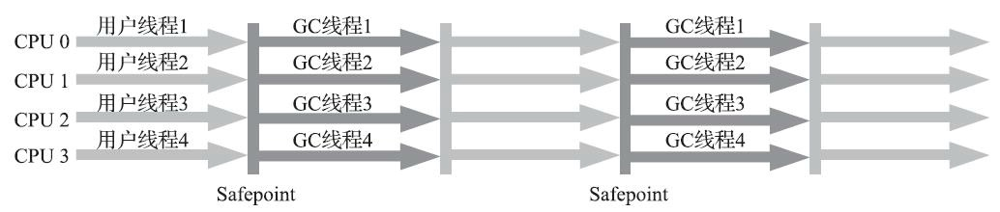
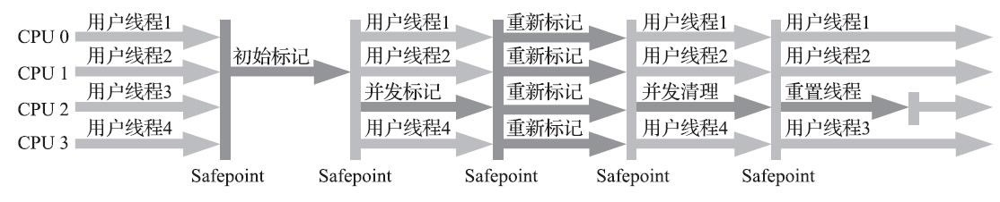
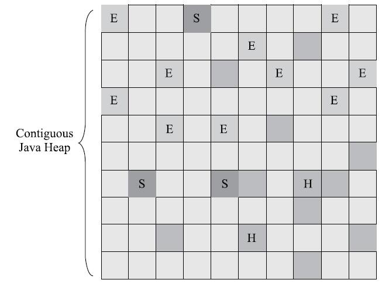
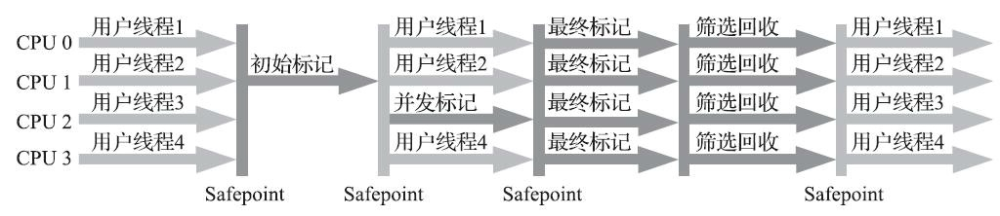

# Java_JVM_GC

## 1、解决的问题

<!--more-->

## 2、如何判断对象可以回收

### 2.1 引用计数法

- **算法描述：**
  - 给对象添加一个引用计数器；
  - 每有一个地方引用它，计数器加 1；
  - 每有一个引用失效时，计数器减 1；
  - 计数器值为 0 的对象不再可用。
- **缺点：**
  - 很难解决循环引用的问题。

### 2.2 可达性分析法

- **算法描述：**
  - 从 "GC Root" 对象作为起点开始向下搜索，走过的路径称为引用链（Reference Chain）；
  - 从 "GC Root" 开始，不可达的对象被判为不可用。
- **Java 中可作为 “GC Root” 的对象：**
  - 栈中（本地变量表中的reference）
    - 虚拟机栈中，栈帧中的本地变量表引用的对象；
    - 本地方法栈中，JNI 引用的对象（native方法）；
  - 方法区中
    - 类的静态属性引用的对象；
    - 常量引用的对象；

即便如此，一个对象也不是一旦被判为不可达，就立即死去的，宣告一个的死亡需要经过两次标记过程。

### 2.3 引用类型

#### **强引用：** 

- 只有所有`GC Root`对象都不通过强引用引用该对象，该对象才能被垃圾回收。

#### **软引用** SoftReference

- 用来引用还存在但非必须的对象。
- 如果仅有软引用引用该对象，在垃圾回收后，内存仍不足时，会再次触发垃圾回收，回收软引用对象。如果这次回收后，内存还是不够用，就 OOM。
- 可以配合引用队列来释放软引用自身。
- 实现类：`SoftReference`。

#### **弱引用** WeakReference

- 被弱引用引用的对象只能生存到下一次垃圾收集前，一旦发生垃圾收集，无论内存是否充足，被弱引用所引用的对象就会被清掉。
- 实现类：`WeakReference`。

#### **虚引用** PhantomReference

- 必须配合引用队列使用，主要配合`ByteBuffer`使用，被引用对象回收时，会将虚引用入队，由`Reference Handle`线程调用虚引用相关方法释放直接内存。
- 用途：当被一个虚引用引用的对象被回收时，系统会收到这个对象被回收了的通知。
- 实现类：`PhantomReference`。

#### **终结器引用** FinalReference

- 无需手动编码，但其内部配合引用队列使用，在垃圾回收时，终结器引用入队（被引用对象暂时没有被回收），再由Finalizer线程通过终结器引用找到被引用对象并调用它的finalize方法，第二次GC时才能回收被引用对象。

### 宣告对象死亡的两次标记过程

- 当发现对象不可达后，该对象被第一次标记，并进行是否有必要执行 `finalize()` 方法的判断；
  - 不需要执行：对象没有覆盖 `finalize()` 方法，或者 `finalize()` 方法已被执行过（`finalize()` 只被执行一次）；
  - 需要执行：将该对象放置在一个队列中，稍后由一个虚拟机自动创建的低优先级线程执行。
- `finalize()` 方法是对象逃脱死亡的最后一次机会，不过虚拟机不保证等待 `finalize()` 方法执行结束，也就是说，虚拟机只触发 `finalize()` 方法的执行，如果这个方法要执行超久，那么虚拟机并不等待它执行结束，所以最好不要用这个方法。
- `finalize()` 方法能做的，try-finally 都能做。不建议使用。

### 方法区的回收

永久代的 GC 主要回收：**废弃常量** 和 **无用的类**。

- 废弃常量：例如一个字符串 "abc"，当没有任何引用指向 "abc" 时，它就是废弃常量了。
- 无用的类：同时满足以下 3 个条件的类。
  - 该类的所有实例已被回收，Java 堆中不存在该类的任何实例；
  - 加载该类的 Classloader 已被回收；
  - 该类的 Class 对象没有被任何地方引用，即无法在任何地方通过反射访问该类的方法。

## 3、垃圾收集算法

### 3.1  标记 - 清除算法 Mark-Sweep

- 原理：
  - 分为标记和清除两个阶段：首先标记出所有的需要回收的对象(下图深色区域)，在标记完成以后统一回收所有被标记的对象。
- 特点：
  - 效率问题：标记和清理两个过程的效率都不高。
  - 空间碎片问题：标记清除后会产生大量不连续的内存碎片，导致以后为较大的对象分配内存时找不到足够的连续内存，会提前触发另一次 GC。
- 适合在老年代进行垃圾回收，比如CMS收集器就是采用该算法进行回收的。
- 关于这里的标记，有不同的说法：有说标记存活的活跃对象，然后清除未标记的对象。

### 3.2 标记 - 整理算法 Mark-Compact

* 原理：
  * 分为标记和整理两个阶段：首先标记出所有需要回收的对象，让所有存活的对象都向一端移动，然后直接清理掉端边界以外的内存。
* 特点：
  * 不会产生空间碎片，但是整理会花一定的时间。
* 适合老年代进行垃圾收集，parallel Old（针对parallel scanvange gc的） gc和Serial old收集器就是采用该算法进行回收的。

### 3.3 标记 - 复制算法

* 原理：
  * 它先将可用的内存按容量划分为大小相同的两块，每次只是用其中的一块。当这块内存用完了，就将还存活着的对象复制到另一块上面，然后把已经使用过的内存空间一次清理掉。
* 特点：
  * 没有内存碎片，只要移动堆顶指针，按顺序分配内存即可。
  * 可用内存缩小为原来的一半，适合GC过后只有少量对象存活的新生代。
* 适合新生代区进行垃圾回收。serial new，parallel new和parallel scanvage收集器，就是采用该算法进行回收的。

* 改良：

  - 新生代中的对象 98% 都是朝生夕死的，所以不需要按照 1:1 的比例对内存进行划分；
    - 把内存划分为：
      - 1 块比较大的 Eden 区；
      - 2 块较小的 Survivor 区；

  - 每次使用 Eden 区和 1 块 Survivor 区；

  - 回收时，将以上 2 部分区域中的存活对象复制到另一块 Survivor 区中，然后将以上两部分区域清空；

  - JVM 参数设置：`-XX:SurvivorRatio=8` 表示 `Eden 区大小 / 1 块 Survivor 区大小 = 8`。
  - 缺点
    - 需要其他区域（实际大都是老年代）进行分配担保（Handle Promotion），如果第二块的Survivor空间不够的时候，需要对老年代进行垃圾回收，然后存储新生代的对象，这些新生代当然会直接进入来老年代。

### 3.4 优化：分代收集算法

* 原理：根据对象存活的周期的不同将内存划分为几块，然后再选择合适的收集算法。
  * 新生代： 每次垃圾收集都会有大量的对象死去，只有少量存活，所以选用复制算法
  * 老年代： 对象存活率高，没有额外空间对他进行分配担保，所以一般采用标记整理或者标记清除算法进行回收

## 4、 HotSpot 中 GC 算法的实现

### 4.1 前言

通过之前的分析，GC 算法的实现流程简单的来说分为以下两步：

1. 找到死掉的对象；
2. 把它清了。

想要找到死掉的对象，我们就要进行可达性分析，也就是从 GC Root 找到引用链的这个操作。

也就是说，进行可达性分析的第一步，就是要枚举 GC Roots，这就需要虚拟机知道哪些地方存放着对象应用。如果每一次枚举 GC Roots 都需要把整个栈上位置都遍历一遍，那可就费时间了，毕竟并不是所有位置都存放在引用呀。所以为了提高 GC 的效率，HotSpot 使用了一种 OopMap 的数据结构，**OopMap 记录了栈上本地变量到堆上对象的引用关系**，也就是说，GC 的时候就不用遍历整个栈只遍历每个栈的 OopMap 就行了。

在 OopMap 的帮助下，HotSpot 可以快速准确的完成 GC 枚举了，不过，OopMap 也不是万年不变的，它也是需要被更新的，当内存中的对象间的引用关系发生变化时，就需要改变 OopMap 中的相应内容。可是能导致引用关系发生变化的指令非常之多，如果我们执行完一条指令就改下 OopMap，这 GC 成本实在太高了。

因此，HotSpot 采用了一种在 “安全点” 更新 OopMap 的方法，安全点的选取既不能让 GC 等待的时间过长，也不能过于频繁增加运行负担，也就是说，我们既要让程序运行一段时间，又不能让这个时间太长。我们知道，JVM 中每条指令执行的是很快的，所以一个超级长的指令流也可能很快就执行完了，所以 **真正会出现 “长时间执行” 的一般是指令的复用，例如：方法调用、循环跳转、异常跳转等**，虚拟机一般会将这些地方设置为安全点更新 OopMap 并判断是否需要进行 GC 操作。

此外，在进行枚举根节点的这个操作时，为了保证准确性，我们需要在一段时间内 “冻结” 整个应用，即 Stop The World（传说中的 GC 停顿），因为如果在我们分析可达性的过程中，对象的引用关系还在变来变去，那是不可能得到正确的分析结果的。即便是在号称几乎不会发生停顿的 CMS 垃圾收集器中，枚举根节点时也是必须要停顿的。这里就涉及到了一个问题：

**我们让所有线程跑到最近的安全点再停顿下来进行 GC 操作呢？**

主要有以下两种方式：

- 抢先式中断：
  - 先中断所有线程；
  - 发现有线程没中断在安全点，恢复它，让它跑到安全点。
- **主动式中断：** (主要使用)
  - 设置一个中断标记；
  - 每个线程到达安全点时，检查这个中断标记，选择是否中断自己。

除此安全点之外，还有一个叫做 “安全区域” 的东西，一个一直在执行的线程可以自己 “走” 到安全点去，可是一个处于 Sleep 或者 Blocked 状态的线程是没办法自己到达安全点中断自己的，我们总不能让 GC 操作一直等着这些个 ”不执行“ 的线程重新被分配资源吧。对于这种情况，我们要依靠安全区域来解决。

**安全区域是指在一段代码片段之中，引用关系不会发生变化，因此在这个区域中的任意位置开始 GC 都是安全的。**

当线程执行到安全区域时，它会把自己标识为 Safe Region，这样 JVM 发起 GC 时是不会理会这个线程的。当这个线程要离开安全区域时，它会检查系统是否在 GC 中，如果不在，它就继续执行，如果在，它就等 GC 结束再继续执行。

本小节我们主要讲述 HotSpot 虚拟机是如何发起内存回收的，也就是如何找到死掉的对象，至于如何清掉这些个对象，HotSpot 将其交给了一堆叫做 ”GC 收集器“ 的东西，这东西又有好多种，不同的 GC 收集器的处理方式不同，适用的场景也不同，我们将在下一小节进行详细讲述。

### 4.2 垃圾收集器

**注**：仅仅作为记录，加深自己印象。不建议阅读此拾人牙慧学习，建议直接看《深入理解JVM》原文.

#### 4.2.0 总览

HotSpot 7种作用于不同分代的收集器。连线代表可以搭配使用。

概念：

##### 并行和并发

- 并行（Parallel）：指多条垃圾收集线程并行工作，但默认此时用户线程仍然处于等待状态。
- 并发（Concurrent）：指用户线程与垃圾收集线程同时执行（但不一定是并行的，可能会交替执行）。由于用户程序没有冻结，所以成语仍然能够响应服务请求；但是由于垃圾收集器线程占用一定的系统资源，此时应用程序的处理的吞吐量会受到影响。

##### 吞吐量（Throughput）

吞吐量就是CPU用于运行用户代码的时间与CPU总消耗时间的比值，即

吞吐量 = 运行用户代码时间 /（运行用户代码时间 + 垃圾收集时间）。

假设虚拟机总共运行了100分钟，其中垃圾收集花掉1分钟，那吞吐量就是99%。

##### Minor GC 和 Full GC

- 新生代GC（Minor GC）：指发生在新生代的垃圾收集动作，因为Java对象大多都具备朝生夕灭的特性，所以Minor GC非常频繁，一般回收速度也比较快。具体原理见上一篇文章。
- 老年代GC（Major GC / Full GC）：指发生在老年代的GC，出现了Major GC，经常会伴随至少一次的Minor GC（但非绝对的，在Parallel Scavenge收集器的收集策略里就有直接进行Major GC的策略选择过程）。Major GC的速度一般会比Minor GC慢10倍以上。

#### 4.2.1 Serial 收集器

Serial（串行）收集器是最基本、发展历史最悠久的收集器，它是采用复制算法的新生代收集器，曾经（JDK 1.3.1之前）是虚拟机新生代收集的唯一选择。

它是一个单线程收集器，只会使用一个CPU或一条收集线程去完成垃圾收集工作，更重要的是它在进行垃圾收集时，必须暂停其他所有的工作线程，直至Serial收集器收集结束为止（“Stop The World”）。

这项工作是由虚拟机在后台自动发起和自动完成的，在用户不可见的情况下把用户正常工作的线程全部停掉，这对很多应用来说是难以接收的。

下图展示了Serial 收集器（老年代采用Serial Old收集器）的运行过程：

为了消除或减少工作线程因内存回收而导致的停顿，HotSpot虚拟机开发团队在JDK 1.3之后的Java发展历程中研发出了各种其他的优秀收集器，这些将在稍后介绍。但是这些收集器的诞生并不意味着Serial收集器已经“老而无用”，实际上到现在为止，它依然是HotSpot虚拟机运行在Client模式下的默认的新生代收集器。

它也有着优于其他收集器的地方：简单而高效（与其他收集器的单线程相比），对于限定单个CPU的环境来说，Serial收集器由于没有线程交互的开销，专心做垃圾收集自然可以获得更高的单线程收集效率。

在用户的桌面应用场景中，分配给虚拟机管理的内存一般不会很大，收集几十兆甚至一两百兆的新生代（仅仅是新生代使用的内存，桌面应用基本不会再大了），停顿时间完全可以控制在几十毫秒最多一百毫秒以内，只要不频繁发生，这点停顿时间可以接收。

所以，Serial收集器对于运行在客户端模式下的虚拟机来说是一个很好的选择。

#### 4.2.2 ParNew 收集器

ParNew收集器就是Serial收集器的多线程版本，它也是一个新生代收集器。除了使用多线程进行垃圾收集外，其余行为包括Serial收集器可用的所有控制参数、收集算法（复制算法）、Stop The World、对象分配规则、回收策略等与Serial收集器完全相同，两者共用了相当多的代码。

ParNew收集器的工作过程如下图（老年代采用Serial Old收集器）：

ParNew收集器除了使用多线程收集外，其他与Serial收集器相比并无太多创新之处，但它却是许多运行在Server模式下的虚拟机中首选的新生代收集器，其中有一个与性能无关的重要原因是，除了Serial收集器外，目前只有它能和CMS收集器（Concurrent Mark Sweep）配合工作。

ParNew 收集器在单CPU的环境中绝对不会有比Serial收集器有更好的效果，甚至由于存在线程交互的开销，该收集器在通过超线程技术实现的两个CPU的环境中都不能百分之百地保证可以超越。

在多CPU环境下，随着CPU的数量增加，它对于GC时系统资源的有效利用是很有好处的。它默认开启的收集线程数与CPU的数量相同，在CPU非常多的情况下可使用-XX:ParallerGCThreads参数设置。

#### 4.2.3 Parallel Scavenge 收集器

Parallel Scavenge收集器也是一个并行的多线程新生代收集器，它也使用复制算法。Parallel Scavenge收集器的特点是它的关注点与其他收集器不同，CMS等收集器的关注点是尽可能缩短垃圾收集时用户线程的停顿时间，而Parallel Scavenge收集器的目标是达到一个可控制的吞吐量（Throughput）。

停顿时间越短就越适合需要与用户交互的程序，良好的响应速度能提升用户体验。而高吞吐量则可以高效率地利用CPU时间，尽快完成程序的运算任务，主要适合在后台运算而不需要太多交互的任务。

Parallel Scavenge收集器除了会显而易见地提供可以精确控制吞吐量的参数，还提供了一个参数-XX:+UseAdaptiveSizePolicy，这是一个开关参数，打开参数后，就不需要手工指定新生代的大小（-Xmn）、Eden和Survivor区的比例（-XX:SurvivorRatio）、晋升老年代对象年龄（-XX:PretenureSizeThreshold）等细节参数了。

虚拟机会根据当前系统的运行情况收集性能监控信息，动态调整这些参数以提供最合适的停顿时间或者最大的吞吐量，这种方式称为GC自适应的调节策略（GC Ergonomics）。自适应调节策略也是Parallel Scavenge收集器与ParNew收集器的一个重要区别。

另外值得注意的一点是，Parallel Scavenge收集器无法与CMS收集器配合使用，所以在JDK 1.6推出Parallel Old之前，如果新生代选择Parallel Scavenge收集器，老年代只有Serial Old收集器能与之配合使用。

#### 4.2.4 Serial Old 收集器

Serial Old 是 Serial收集器的老年代版本，它同样是一个单线程收集器，使用“标记-整理”（Mark-Compact）算法。

此收集器的主要意义也是在于给Client模式下的虚拟机使用。如果在Server模式下，它还有两大用途：

- 在JDK1.5 以及之前版本（Parallel Old诞生以前）中与Parallel Scavenge收集器搭配使用。
- 作为CMS收集器的后备预案，在并发收集发生Concurrent Mode Failure时使用。

它的工作流程与Serial收集器相同，这里再次给出Serial/Serial Old配合使用的工作流程图：

#### 4.2.5 Parallel Old 收集器

Parallel Old收集器是Parallel Scavenge收集器的老年代版本，使用多线程和“标记-整理”算法。前面已经提到过，这个收集器是在JDK 1.6中才开始提供的，在此之前，如果新生代选择了Parallel Scavenge收集器。

老年代除了Serial Old以外别无选择，所以在Parallel Old诞生以后，“吞吐量优先”收集器终于有了比较名副其实的应用组合，在注重吞吐量以及CPU资源敏感的场合，都可以优先考虑Parallel Scavenge加Parallel Old收集器。

Parallel Old收集器的工作流程与Parallel Scavenge相同，这里给出Parallel Scavenge/Parallel Old收集器配合使用的流程图：

#### 4.2.6 CMS 收集器

CMS（Concurrent Mark Sweep）收集器是一种以获取最短回收停顿时间为目标的收集器，它非常符合那些集中在互联网站或者B/S系统的服务端上的Java应用，这些应用都非常重视服务的响应速度。从名字上（“Mark Sweep”）就可以看出它是基于“标记-清除”算法实现的。

CMS收集器工作的整个流程分为以下4个步骤：

- 初始标记（CMS initial mark）：仅仅只是标记一下GC Roots能直接关联到的对象，速度很快，需要“Stop The World”。
- 并发标记（CMS concurrent mark）：进行GC Roots Tracing的过程，在整个过程中耗时最长。
- 重新标记（CMS remark）：为了修正并发标记期间因用户程序继续运作而导致标记产生变动的那一部分对象的标记记录，这个阶段的停顿时间一般会比初始标记阶段稍长一些，但远比并发标记的时间短。此阶段也需要“Stop The World”。
- 并发清除（CMS concurrent sweep）

由于整个过程中耗时最长的并发标记和并发清除过程收集器线程都可以与用户线程一起工作。

所以，从总体上来说，CMS收集器的内存回收过程是与用户线程一起并发执行的。通过下图可以比较清楚地看到CMS收集器的运作步骤中并发和需要停顿的时间：

优点

* CMS是一款优秀的收集器，它的主要优点在名字上已经体现出来了：并发收集、低停顿，因此CMS收集器也被称为并发低停顿收集器（Concurrent Low Pause Collector）。

缺点

- 对CPU资源非常敏感 其实，面向并发设计的程序都对CPU资源比较敏感。在并发阶段，它虽然不会导致用户线程停顿，但会因为占用了一部分线程（或者说CPU资源）而导致应用程序变慢，总吞吐量会降低。
- CMS默认启动的回收线程数是（CPU数量+3）/4，也就是当CPU在4个以上时，并发回收时垃圾收集线程不少于25%的CPU资源，并且随着CPU数量的增加而下降。但是当CPU不足4个时（比如2个），CMS对用户程序的影响就可能变得很大，如果本来CPU负载就比较大，还要分出一半的运算能力去执行收集器线程，就可能导致用户程序的执行速度忽然降低了50%，其实也让人无法接受。
- 无法处理浮动垃圾（Floating Garbage） 可能出现“Concurrent Mode Failure”失败而导致另一次Full GC的产生。
- 由于CMS并发清理阶段用户线程还在运行着，伴随程序运行自然就还会有新的垃圾不断产生。这一部分垃圾出现在标记过程之后，CMS无法再当次收集中处理掉它们，只好留待下一次GC时再清理掉。
- 这一部分垃圾就被称为“浮动垃圾”。也是由于在垃圾收集阶段用户线程还需要运行，那也就还需要预留有足够的内存空间给用户线程使用，因此CMS收集器不能像其他收集器那样等到老年代几乎完全被填满了再进行收集，需要预留一部分空间提供并发收集时的程序运作使用。
- 标记-清除算法导致的空间碎片 CMS是一款基于“标记-清除”算法实现的收集器，这意味着收集结束时会有大量空间碎片产生。
- 空间碎片过多时，将会给大对象分配带来很大麻烦，往往出现老年代空间剩余，但无法找到足够大连续空间来分配当前对象。

#### 4.2.7 Garbage First （G1）收集器 todo

#### 4.2.8 Shenandoah 收集器

#### 4.2.9 ZGC 收集器

#### 4.2.10 Epsilon 收集器

